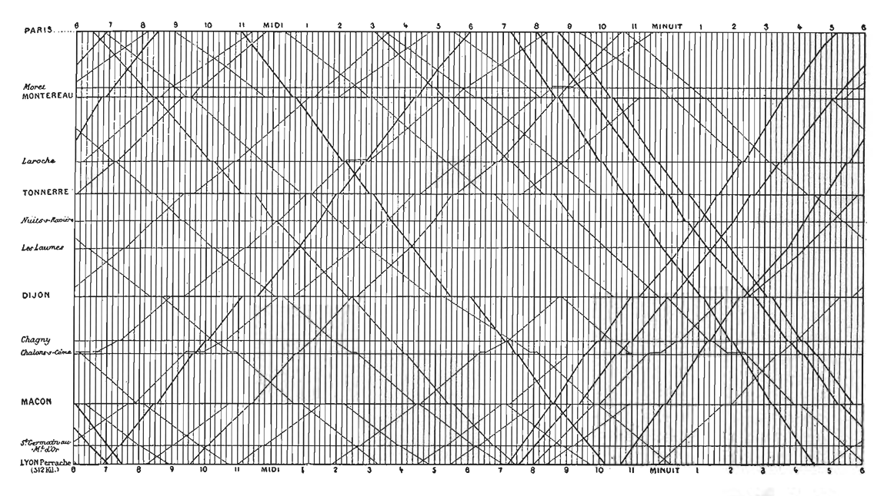

**1. 
a) What is the most interesting lesson, guide, or piece of advice Tufte offers you in this chapter?**

In the Reading, Tufte emphasizes on how graphics can display what numbers alone cannot. It gives a clear story and a purpose with the graphics. From John Snow's cholera map to Marey's train schedule, It answers questions and revealing something new.

Another example is Anscombe's Quartet; four datasets with same statistical summary looks entirely different when visualized.

**b)**

I chose Marey's Train schedule. I thought this was very interesting visualization. At a first glance, it just looks like a grid with a bunch of scribbles of lines. However looking deep, it conveys a lot of information.

Encoding channels:

x-axis = Time of day
y-axis = Geographic location, spaced proportionally to actual distance
Slope of the line = Speed of the train
Horizontal segments = How long the train stops at a station
Intersection of two lines = The exact time and place where two trains traveling in opposite directions pass each other

The y axis segments setting it proportionally will be very hard for me to do it manually.

Tufte's point: Every visual elemten has a purpose, and nothing is decorative. "complex ideas communicated with clarity, precision, and efficiency"